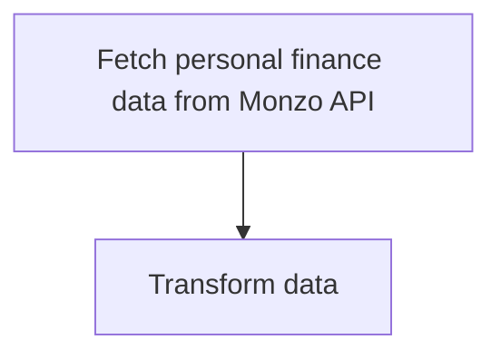

# Monzo ETL Pipeline

A Python ETL pipeline for extracting transaction data from Monzo's API and loading it into a SQLite database stored in an S3 bucket, with logging to S3.

## Overview

- Fetch transaction data from the Monzo API using OAuth2 authentication
- MonzoAPIClient provides interface with Monzo API
- MonzoTokenManager automates API token management 
- Transform and load the data into a SQLite database
- Upload database backups to S3
- Log pipeline operations both locally and to S3

## Pipeline flowchart

    B --> C[Load data into SQLite database]
    C --> D[Upload database to S3]
    D --> E[Log operations locally and to S3]



## Directory Structure
```bash
monzo-data-eng/ 
├─── data/
├─── notebooks/
│   ├─── currency_ex_rate_api.ipynb
│   ├─── monzo_auth_test.ipynb
│   └─── query_sqlite_db.ipynb
├─── src/
│   ├─── extract/
│   │   └─── extract.py
│   ├─── load/
│   │   └─── load.py
│   ├─── sql/
│   │   ├─── create_bronze_layer.sql
│   │   ├─── create_gold_layer.sql
│   │   ├─── create_silver_layer.sql
│   │   └─── transform_bronze_to_silver.sql
│   ├─── transform/
│   │   └─── transform.py
│   ├─── utils/
│   │   ├─── api/
│   │   │   ├─── api_client.py
│   │   │   ├─── oauth_flow.py
│   │   │   └─── token_manager.py
│   │   ├─── initialise_database.py
│   │   ├─── logging_utils.py
│   │   └─── utils.py        
│   └─── main.py
├── tests/
│   ├── test_extract.py
│   ├── test_load.py
│   ├── test_main.py
│   └── test_transform.py
├─── .dockerignore
├─── .gitignore
├─── Dockerfile
├─── README.md
├─── docker-compose.yaml
└─── requirements.txt
```